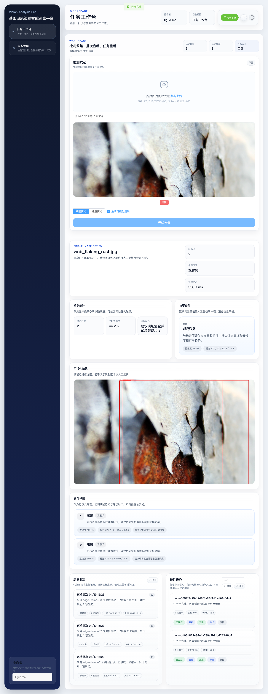

# 端到端 Demo 演示指南

本文档演示如何在本地环境运行完整的推理服务和边缘 Agent，并获取检测结果。

---

## 📋 前置要求

- **Python 3.12+**（推荐使用 `uv` 管理环境）
- **Node.js 20+**（前端开发）
- **操作系统**：macOS / Linux / Windows

---

## 🚀 快速开始

### 1. 克隆仓库并进入目录

```bash
git clone <repository-url>
cd vision_analysis_pro
```

### 2. 安装依赖

```bash
# 安装基础依赖
uv sync

# 安装 ONNX Runtime 支持（推荐，性能提升 7.25x）
uv sync --extra onnx

# 安装开发依赖（测试）
uv sync --extra dev
```

### 3. 启动 API 服务

```bash
# 默认：使用 YOLO 引擎
uv run uvicorn vision_analysis_pro.web.api.main:app --reload

# 使用 ONNX 引擎（更快）
INFERENCE_ENGINE=onnx uv run uvicorn vision_analysis_pro.web.api.main:app --reload

# 使用 Stub 引擎（固定输出，用于演示）
INFERENCE_ENGINE=stub uv run uvicorn vision_analysis_pro.web.api.main:app --reload
```

服务将在 `http://127.0.0.1:8000` 启动。

**验证服务**：

```bash
curl http://127.0.0.1:8000/api/v1/health
```

预期输出：

```json
{
  "status": "healthy",
  "version": "0.1.0",
  "model_loaded": true,
  "engine": "YOLOInferenceEngine"
}
```

---

## 🎯 API 推理演示

### 场景 1：基础推理（返回 JSON 检测结果）

```bash
curl -X POST "http://127.0.0.1:8000/api/v1/inference/image" \
  -F "file=@test_image.jpg" \
  -H "Content-Type: multipart/form-data"
```

**预期响应**：

```json
{
  "filename": "test_image.jpg",
  "detections": [
    {
      "label": "crack",
      "confidence": 0.95,
      "bbox": [100.0, 150.0, 300.0, 400.0]
    }
  ],
  "metadata": {
    "engine": "YOLOInferenceEngine"
  },
  "visualization": null
}
```

### 场景 2：带可视化的推理

```bash
curl -X POST "http://127.0.0.1:8000/api/v1/inference/image?visualize=true" \
  -F "file=@test_image.jpg" \
  -o response.json

# 提取并保存可视化图像
cat response.json | jq -r '.visualization' | sed 's/^data:image\/jpeg;base64,//' | base64 -d > output_with_bbox.jpg
```

### 场景 3：使用 Python 脚本

```bash
uv run python examples/demo_request.py test_image.jpg
```

---

## 🧭 完整巡检主流程

HE-008 后，Demo 的单一 happy path 固定为：上传/批量任务 → 推理与可视化 → 上报批次 → 人工复核 → 模板摘要 → 导出。

2026-05-07 后，演示口径调整为“试点系统封装优先”：在真实环境样本暂不可得前，演示重点是部署、采集、上报、复核、报告、导出、观测和回滚链路，而不是宣称多类塔材模型精度。客户正式演示的检测结果必须来自真实模型 profile：优先 Stage A ONNX，必要时回退 Stage A YOLO；`stub` 只用于内部链路自检，不能作为客户演示的检测结果来源。

如果部署机器不带到客户现场，使用 `docs/customer-remote-demo.md` 的远程演示流程；不要把远程 Edge Agent 回放描述为客户现场实时采集。

### Happy path

1. 启动 API 和前端：

```bash
INFERENCE_ENGINE=onnx ONNX_MODEL_PATH=models/stage_a_crack/best.onnx \
  uv run uvicorn vision_analysis_pro.web.api.main:app --reload
cd web
npm run dev
```

2. 在前端上传一张图片或多张图片，确认结果区展示检测数量、首要缺陷和可视化图。
3. 对批量任务确认任务状态为 `completed`，按需导出 CSV、JSON 或 ZIP。
4. Edge Agent 或外部系统将同一巡检批次上报到云端：

```bash
curl -X POST "http://127.0.0.1:8000/api/v1/report" \
  -H "Content-Type: application/json" \
  -d '{
    "device_id": "edge-agent-001",
    "batch_id": "edge-agent-001-demo",
    "report_time": 1700000000.0,
    "results": [
      {
        "frame_id": 1,
        "timestamp": 1700000000.0,
        "source_id": "edge-agent-001",
        "detections": [
          {
            "label": "crack",
            "confidence": 0.95,
            "bbox": [100.0, 150.0, 300.0, 400.0]
          }
        ],
        "inference_time_ms": 12.4,
        "metadata": {"image_name": "tower_001.jpg"}
      }
    ]
  }'
```

5. 复核单帧结果，生成摘要并导出报告 CSV：

```bash
curl -X PUT "http://127.0.0.1:8000/api/v1/report/edge-agent-001-demo/reviews/1" \
  -H "Content-Type: application/json" \
  -d '{"status": "confirmed", "note": "人工确认裂缝", "reviewer": "qa"}'

curl "http://127.0.0.1:8000/api/v1/report/edge-agent-001-demo/summary"
curl "http://127.0.0.1:8000/api/v1/report/edge-agent-001-demo/export.csv" \
  -o edge-agent-001-demo.csv
```

### Trial rehearsal checklist

本地试点预演建议按以下顺序执行：

1. `docker compose config`，确认 Compose profile 可解析。
2. 用 `INFERENCE_ENGINE=onnx` 启动 API，验证 `/api/v1/health`、`/api/v1/health/ready`、`/api/v1/metrics`。
3. 上传单张有效图片，验证 `/api/v1/inference/image`。
4. 创建批量任务，验证 `/api/v1/inference/images/tasks` 到 `completed`。
5. 上报一个巡检批次，验证 `/api/v1/report`。
6. 写入人工复核，验证 `/api/v1/report/{batch_id}/reviews/{frame_id}`。
7. 生成摘要并导出 CSV，验证 `/summary` 和 `/export.csv`。
8. 检查 `/reports/batches`、`/reports/devices`、`/reports/alerts/summary`。
9. 如 ONNX 不可用，使用 Stage A YOLO 作为真实模型 fallback；如两者都不可用，才切 `stub` 做内部链路排查。
10. 用 Edge Agent + Stage A ONNX + 有效 Stage A 样本上报一帧，确认 API 批次列表可见。

真实模型 smoke 不要使用 `data/samples/web_rust_bolt.jpg`；该文件当前是 HTML 文档而不是有效 JPEG。可使用 `data/samples/web_rust_chain.jpg` 或 `data/stage_a_crack/images/val/` 下的有效样本。

现场测试后的数据采集、metadata、人工复核、标注交接和训练入口见 `docs/field-data-intake-and-review.md`。

### Recovery path

- 批量任务 `failed` 时查看任务详情后重试；`partial_failed` 时优先 retry-failed；已完成但需要复验时 rerun；导出结果可用于离线比对。
- Edge Agent 上报失败时会先按配置重试，仍失败且 `cache.enabled=true` 时写入本地 SQLite；云端恢复后自动回放。同一 `batch_id` 回放返回 `duplicate`，不会重复累计结果数或检测数。
- 配置 `CLOUD_API_KEY` 后，report、summary、detail、export 和设备视图都需要携带 `Authorization: Bearer <key>` 或 `X-API-Key: <key>`。

---

## 🤖 边缘 Agent 演示

边缘 Agent 支持从多种数据源采集图像，执行推理，并将结果上报到云端。

### 启动方式

#### 方式 1：使用配置文件

```bash
# 复制示例配置
cp config/edge_agent.example.yaml config/edge_agent.yaml

# 根据需要修改配置
vim config/edge_agent.yaml

# 启动 Agent
edge-agent -c config/edge_agent.yaml
```

#### 方式 2：使用命令行参数

```bash
python examples/run_edge_agent.py \
  --source-type folder \
  --source-path data/images/test \
  --engine onnx \
  --model-path models/stage_a_crack/best.onnx \
  --report-url http://localhost:8000/api/v1/report \
  --fps-limit 5
```

#### 方式 3：使用环境变量

```bash
EDGE_AGENT_DEVICE_ID=edge-001 \
EDGE_AGENT_SOURCE_TYPE=folder \
EDGE_AGENT_SOURCE_PATH=data/images/test \
EDGE_AGENT_INFERENCE_ENGINE=onnx \
EDGE_AGENT_INFERENCE_MODEL_PATH=models/stage_a_crack/best.onnx \
edge-agent
```

### 支持的数据源

| 类型 | 说明 | 示例配置 |
|------|------|----------|
| `folder` | 图像文件夹 | `path: /path/to/images` |
| `video` | 视频文件 | `path: /path/to/video.mp4` |
| `camera` | 本地摄像头 | `path: 0` (摄像头索引) |
| `rtsp` | RTSP 视频流 | `path: rtsp://user:pass@ip:554/stream` |

### 配置文件示例

```yaml
# config/edge_agent.yaml
device_id: "edge-agent-001"
log_level: "INFO"

source:
  type: folder
  path: data/images/test
  fps_limit: 5.0
  loop: false

inference:
  engine: onnx
  model_path: models/stage_a_crack/best.onnx
  confidence: 0.5
  iou: 0.5

reporter:
  type: http
  url: http://localhost:8000/api/v1/report
  timeout: 30.0
  retry_max: 3
  batch_size: 10
  batch_interval: 5.0

cache:
  enabled: true
  db_path: cache/edge_agent.db
  max_entries: 10000
  max_age_hours: 24.0
```

### 功能特性

- ✅ **多数据源**：视频、图像文件夹、摄像头、RTSP 流
- ✅ **高性能推理**：ONNX Runtime（7.25x 加速）
- ✅ **可靠上报**：默认上报到 `POST /api/v1/report`，支持指数退避重试、云端批次持久化、重复批次幂等与可选 API Key
- ✅ **离线缓存**：网络不可用时本地缓存
- ✅ **优雅关闭**：Ctrl+C 安全退出
- ✅ **灵活配置**：YAML + 环境变量

### 上报接口 Smoke Test

```bash
curl -X POST "http://localhost:8000/api/v1/report" \
  -H "Content-Type: application/json" \
  -d '{
    "device_id": "edge-agent-001",
    "batch_id": "edge-agent-001-demo",
    "report_time": 1700000000.0,
    "results": []
  }'
```

预期返回 `202 Accepted`，并包含 `status=accepted`、`batch_id` 和 `request_id`。

### 模板与 LLM 报告摘要

完成上报后，可以基于已持久化批次生成确定性模板报告：

```bash
curl "http://localhost:8000/api/v1/report/edge-agent-001-demo/summary"
```

该接口默认返回整体风险等级、缺陷发现项、建议动作、`prompt_version`、`output_schema_version` 和 `llm_context`。`llm_context` 是自然语言报告生成的结构化输入，包含复核状态、设备元数据、缺失 metadata、低置信度候选、prompt 契约、输出 schema 和事实保护 guardrails。

如需演示 LLM 报告契约，可用本地确定性 provider 启动 API：

```bash
REPORT_GENERATION_MODE=llm \
REPORT_LLM_PROVIDER=local \
INFERENCE_ENGINE=stub \
uv run uvicorn vision_analysis_pro.web.api.main:app --reload

curl "http://localhost:8000/api/v1/report/edge-agent-001-demo/summary" \
  | jq '{generated_by, prompt_version, output_schema_version, summary}'
```

`REPORT_GENERATION_MODE=llm` 只改变报告文本生成方式，不允许改写检测标签、置信度、bbox、人工复核状态或设备元数据。回滚时把 `REPORT_GENERATION_MODE` 改回 `template` 即可。

### 上报稳态与故障恢复

Edge Agent 的 HTTP reporter 会在网络不可用、连接超时或服务端临时错误时重试；仍失败且 `cache.enabled=true` 时，批次会写入本地 SQLite 缓存。服务恢复后，reporter 会按 FIFO 顺序 flush 缓存。

稳态行为：

- 首次成功上报返回 `status=accepted`。
- 同一 `batch_id` 再次上报返回 `status=duplicate`，云端不会重复累加结果数或检测数。
- duplicate 也视为缓存回放成功，Edge Agent 可清理本地缓存条目。
- 对 replayed batch 调用 `GET /api/v1/report/{batch_id}/summary` 仍会基于首次持久化的批次生成模板摘要。
- 配置 `CLOUD_API_KEY` 后，上报、详情查询、summary、导出和设备视图都需要携带 `Authorization: Bearer <key>` 或 `X-API-Key: <key>`。

常用排查命令：

```bash
# 查看本地缓存文件是否存在
ls -lh cache/edge_agent.db

# 确认云端已接收批次
curl "http://localhost:8000/api/v1/report/edge-agent-001-demo"

# 确认 replayed batch 的摘要仍可生成
curl "http://localhost:8000/api/v1/report/edge-agent-001-demo/summary"

# 启用 API Key 时
curl "http://localhost:8000/api/v1/report/edge-agent-001-demo/summary" \
  -H "Authorization: Bearer ${CLOUD_API_KEY}"
```

失败模式：

- `401 UNAUTHORIZED`：云端配置了 `CLOUD_API_KEY`，但请求缺少密钥或密钥不匹配；修正 Edge Agent `reporter.api_key` 或 `EDGE_AGENT_REPORTER_API_KEY` 后再回放缓存。
- `404 REPORT_NOT_FOUND`：该 `batch_id` 尚未被云端持久化；检查 Edge Agent 日志、上报 URL 和本地缓存。
- 本地缓存持续增长：通常表示云端不可达、URL 错误、API Key 错误或服务端持续返回非 2xx；先恢复云端连通性，再等待 reporter flush。

### 视频关键帧抽取

如需先从巡检视频提取待检测图片，可使用 OpenCV 关键帧工具：

```bash
uv run python scripts/extract_keyframes.py path/to/video.mp4 \
  --output-dir data/keyframes \
  --interval-seconds 1.0 \
  --min-scene-delta 20 \
  --blur-threshold 10
```

当前策略是固定间隔 + 场景变化 + 模糊过滤，优先保证可解释和可复现。

---

## 🌐 前端演示

当前前端已完成一轮产品化视觉提升：工作台和设备页保留 Element Plus 组件能力，但主要视觉身份来自自有品牌侧栏、流程条、操作状态、上传面板和全局组件皮肤。

### 启动前端

```bash
cd web
npm install
npm run dev
```

访问 http://localhost:5173

### 功能

1. **图片上传**：拖拽或点击上传图片
2. **单图/批量任务**：支持单图检测、批量任务、任务列表、复跑、删除与导出
3. **结果展示**：检测框、置信度、类别、建议动作与模板报告摘要
4. **健康状态**：实时显示后端服务状态

### 当前工作台截图



---

## 🔍 API 文档

启动服务后，访问交互式 API 文档：

- **Swagger UI**: http://127.0.0.1:8000/docs
- **ReDoc**: http://127.0.0.1:8000/redoc

---

## 📊 性能基准

运行性能基准测试：

```bash
uv run python scripts/benchmark.py --iterations 30 --output docs/benchmark-report.md
```

**测试结果**（Apple M4）：

| 引擎 | 平均延迟 (ms) | P95 (ms) | FPS | 加速比 |
|------|--------------|----------|-----|--------|
| YOLO | 33.36 | 34.78 | 29.97 | 1.0x |
| ONNX | 4.60 | 5.38 | 217.24 | **7.25x** |

---

## 🧪 运行测试

```bash
# 全部后端测试
uv run pytest tests/ -v

# 边缘 Agent 测试
uv run pytest tests/test_edge_agent.py -v

# 前端测试
cd web && npm run test -- --run
```

**预期结果**：
- 后端：218 passed, 44 skipped（当前轻量环境；缺少 legacy `models/best.onnx`、`data/images/*` 或可选本地模型产物时跳过对应测试）
- 前端：90 passed，浏览器 E2E 3 passed

---

## ⚠️ 当前限制

1. **文件限制**：
   - 最大文件大小：10MB
   - 支持格式：JPEG, PNG, JPG, WebP

2. **边缘 Agent**：
   - MQTT 上报器尚未实现（当前使用 HTTP）
   - 视频源默认逐帧读取；可通过 `source.keyframes.enabled=true` 启用关键帧模式

3. **可视化**：
   - 当检测结果为空时不生成可视化图像

---

## 🐛 常见问题

### 问题 1: `ModuleNotFoundError: No module named 'vision_analysis_pro'`

```bash
# 方案 1：使用 PYTHONPATH
PYTHONPATH=src uv run uvicorn vision_analysis_pro.web.api.main:app --reload

# 方案 2：安装包到环境
uv pip install -e .
```

### 问题 2: ONNX 模型不存在

```bash
# 导出 ONNX 模型
uv run python scripts/export_onnx.py \
  --model runs/stage_a_crack/baseline_v0_1/weights/best.pt \
  --output models/stage_a_crack/best.onnx
```

### 问题 3: 端口 8000 被占用

```bash
uv run uvicorn vision_analysis_pro.web.api.main:app --reload --port 8001
```

### 问题 4: 边缘 Agent 上报失败

检查：
1. 云端 API 是否启动
2. 上报 URL 是否正确
3. 查看离线缓存：`cache/edge_agent.db`

---

## 📞 反馈

如遇到问题或有建议，请提交 Issue 或联系开发团队。

---

**最后更新**：2026-04-22
